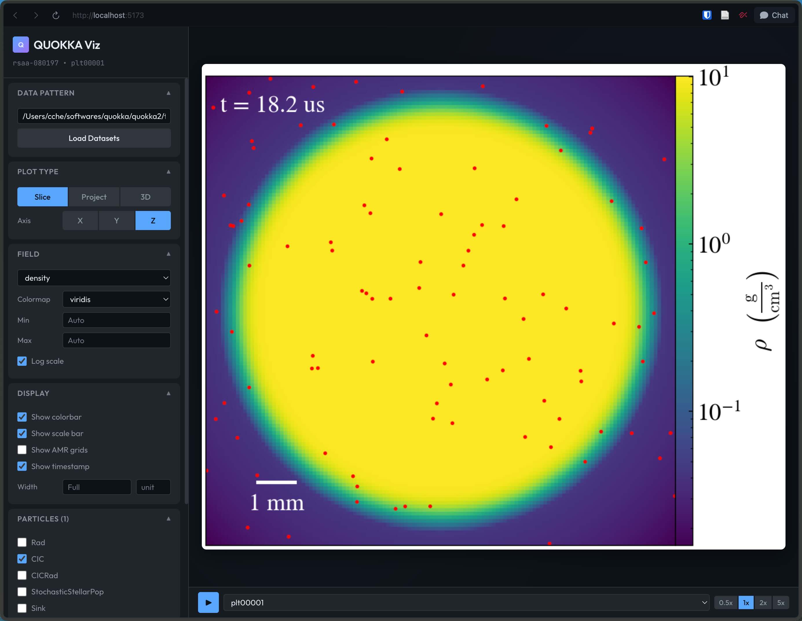

# yt-studio

A visualization tool for [QUOKKA](https://github.com/quokka-astro/quokka) simulation data with both a web interface and Python API.



## Installation

### Prerequisites

- Python 3.9+
- Node.js 18+ (for web interface)

### Install

```bash
pip install git+https://github.com/chongchonghe/yt-studio.git
```

or install from source:

```bash
# Clone the repository
git clone https://github.com/chongchonghe/yt-studio.git
cd yt-studio

# Install in development mode
pip install -e .
```

## Usage

### Web Interface

Start the visualization servers:

```bash
yt-studio
```

Then open http://localhost:5173 in your browser.

**Options:**
```bash
yt-studio --backend-port 8080    # Custom backend port
yt-studio --frontend-port 3000   # Custom frontend port
yt-studio --backend-only         # API server only (no frontend)
```

**Environment Variables:**
```bash
YT_STUDIO_HOST=0.0.0.0    # Host to bind backend (default: 0.0.0.0)
YT_STUDIO_PORT=9010       # Backend port (default: 9010)
```

### Running on a Server with SSH Tunnel

To run the app on a remote server and access it from your local computer:

1. **On the server**, start the application:
   ```bash
   yt-studio
   ```
   The backend will run on port 9010 and frontend on port 5173 (or your custom ports).

2. **On your local computer**, create SSH tunnels for both ports:
   ```bash
   ssh -L 5173:localhost:5173 -L 9010:localhost:9010 user@server
   ```
   Replace `user@server` with your SSH credentials.

3. **Open your browser** and navigate to:
   ```
   http://localhost:5173
   ```

The SSH tunnel forwards traffic from your local ports to the server, allowing you to access the web interface as if it were running locally.

### Python API

```python
from plot_quokka import QuokkaPlotter, PlotParams

# Load a dataset
plotter = QuokkaPlotter("/path/to/plt00020")

# Create a slice plot
plotter.slice("z", "density", output="density_slice.png")

# Create a projection plot
plotter.project("z", "density", output="density_projection.png")

# Customize with parameters
params = PlotParams(cmap="inferno", log_scale=True, dpi=300)
params.colorbar.show = True
params.scale_bar.show = True
plotter.slice("z", "density", params=params, output="custom_slice.png")
```

## Features

- **Slice plots** - 2D cross-sections through simulation data
- **Projection plots** - Line-of-sight integrations with optional weighting
- **Volume rendering** - 3D visualizations with customizable camera
- **Multiple colormaps** - viridis, plasma, inferno, magma, and more
- **Annotations** - Colorbar, scale bar, timestamp, AMR grid overlay
- **Particle overlay** - Visualize particle data on plots
- **High-resolution export** - Publication-quality PNG export (300 DPI)

## License

MIT License

## Known issues

1. In the first run, you may get this error:
```
❯ yt-studio
╔════════════════════════════════════════════╗
║         yt-studio Visualization Tool       ║
╚════════════════════════════════════════════╝

Installing frontend dependencies...
✓ Frontend dependencies installed
Starting backend server...
✗ Backend failed to start (timeout or crash)

Shutting down servers...
✓ All servers stopped
```
The error should disappear the second time you run it. 

2. On macOS with M3/M4 chips, this error has been reported:
```
ValueError: ewah_bool_utils.ewah_bool_wrap.SparseUnorderedBitmaskSet size changed, may indicate binary incompatibility. Expected 72 from C header, got 48 from PyObject
```
The solution is to rebuild `ewah_bool_utils` before installing yt-studio:
```sh
pip install --no-binary ewah_bool_utils -e .
```

